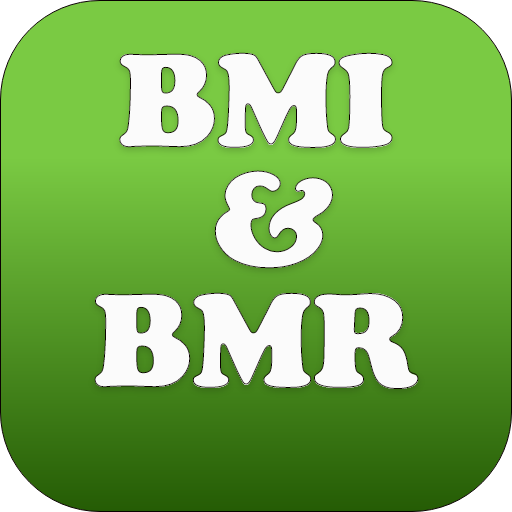
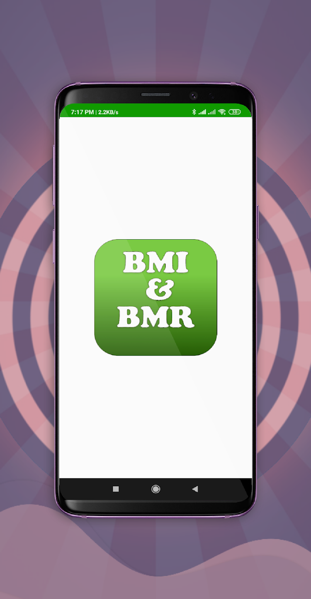
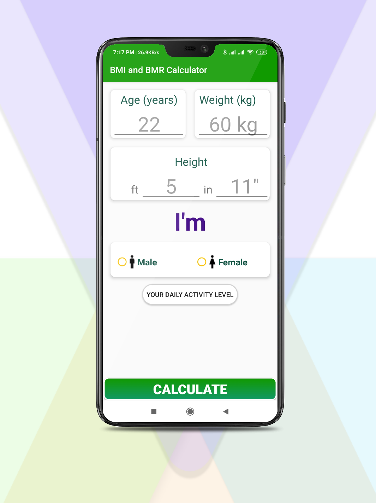
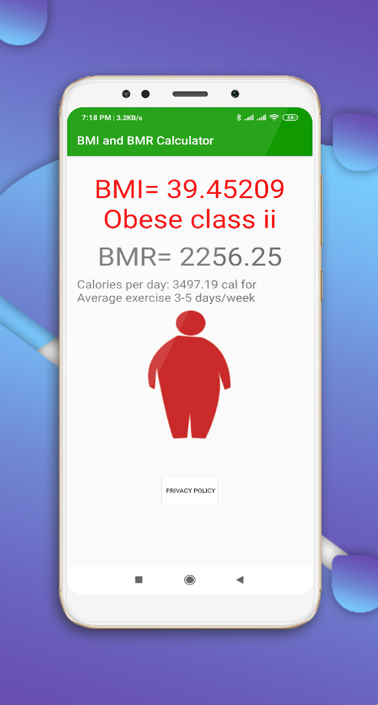

## BMI and BMR Calculator

BMI and BMR Calculator - BMI and BMR Calculator is such an app that helps its users to know and measure their Body Mass Index (BMI) and Basal Metabolic Rate Index (BMR).
This App helps to find the accurate outcome of BMI and BMR measurement based on the weight, height, age and gender provided by the respective users.

## Features

This App helps you to know :

BMI - The body mass index (BMI) helps you to know wether you are under weight/normal weight/over weight or not based on your weight and height.

BMR - Basal Metabolic Rate (BMR) is the number of calories your body requires to function the basic operations of the body at complete rest, with no exercise.

MAIN FEATURES:

• This app is very effective for weight loss / gain program.
• BMI measurement supports calculation for people who are Seven years and older.
• BMR Calculator lets you know the number of calories you need to consume a day.
• No internet connection is required to run the calculation.
• Free to use.

## Icon

## Download on Google Play

## Screenshots

Screenshot#1               |  Screenshot#2            | Screenshot#3
:-------------------------:|:-------------------------:|:-------------------------
  |  |

## 🔗 Links

